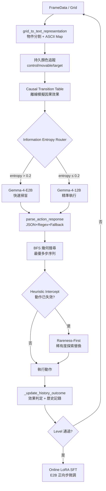

# my_agent_lora.py 技術架構完整摘要 (AGENT_SUMMARY_260611)

> 文件對象：[my_agent_lora.py](file:///home/tim9510019/wisdomCoreV2/task05/direction1_lora/my_agent_lora.py)  
> 撰寫日期：2026-06-11  
> 總行數：1559 行

---

## 概述

`my_agent_lora.py` 是一個針對 **ARC-AGI-3** 互動式謎題遊戲設計的 AI Agent，其核心設計哲學是**第一性原理（First Principles）**：不依賴任何遊戲先驗知識，而是透過物理系統識別、因果推理、資訊熵路由等機制，讓 Agent 能夠自發性地在陌生環境中探索、學習並執行最優解。

---

## 模組一：Grid 空間物件分析 (`grid_to_text_representation`)

> L29–129

1. **背景色自動偵測**：`argmax(color_frequency)` — 找出最高頻率顏色作為背景，零先驗知識。

2. **八連通 BFS 連通域分割**：不受顏色差異限制，只依據空間鄰接性分群，確保複合型控制介面（多色滑軌、旋鈕）不被拆散，被識別為一個整體物件。

3. **幾何形狀自動分類**（依 Bounding Box 長寬比）：

   | 類型 | 判斷條件 |
   |:---|:---|
   | `Single Cell` | size == 1 |
   | `Horizontal Linear Slider/Line` | w >> h |
   | `Vertical Linear Slider/Line` | h >> w |
   | `Square Cluster / Dial` | w ≈ h |
   | `Complex Connected Shape` | 其他 |

4. **ASCII 2D 全地圖生成**：背景用 `·` 代替，其餘顏色用數字/字母表示，供 LLM 直觀感知空間佈局。

---

## 模組二：LoRA 注入、在線訓練與全局模型快取

> L132–260

### 技術 1：LoRALinear（低秩適應）

在凍結基礎模型的前提下，只注入少量可訓練的低秩矩陣 A、B：

```
output = W_base * x + (A * B) * x * (alpha / r)
r = 4, alpha = 8, 注入 q_proj + v_proj
```

### 技術 2：在線 SFT（Level 通關後自動微調）

```
觸發條件：Agent 成功通過一個 Level
資料來源：該 Level 中所有 outcome ≠ "No change" 的正向 step
優化器：AdamW (lr=1e-4, num_epochs=3)
Label Masking：遮蓋 prompt 部分，只對 response 計算 loss
安全防護：整個 SFT 流程包裹在 try-except，OOM/型別錯誤不影響主流程
只在 E2B 模型執行：12B 模型反向傳播會 OOM
```

### 技術 3：全局模型快取 + LoRA 狀態快照/重置

```python
_MODEL_CACHE = {}  # 進程級 singleton

# 初始化時快照 LoRA 初始狀態
lora_state = {k: v.clone() for k, v in model.state_dict().items() if "lora_" in k}

# 切換遊戲時還原
model.load_state_dict(initial_lora_state, strict=False)
```

---

## 模組三：Robust 動作解析器 (`parse_action_response`)

> L263–401

5 層漸進式 fallback，確保任何模型輸出都轉換為合法動作：

| 層 | 策略 |
|:---:|:---|
| 1 | JSON 精確解析（`json.loads`） |
| 2 | **模板偏差自校正**：若 reasoning 中提到的動作與 JSON action 欄位不符，以 reasoning 為準 |
| 3 | ACTION6 座標萃取（正則抓取 `(x,y)` 或 `x=..,y=..`） |
| 4 | 任意動作名稱 Regex 掃描（ACTION1–7, RESET） |
| 5 | 隨機合法動作 Fallback |

---

## 模組四：BFS 幾何對齊搜尋 (`perform_bfs_sequence_search`)

> L557–867

#### 1. 物件角色三角辨識

```
Background Color  = argmax(color_frequency)
Control Objects   = dominant_color ∉ {target_color, movable_color}
Movable Shape     = 有效點擊後發生全局幾何移動的顏色
Target Marker     = 其餘稀有顏色（第2或第3稀有）
```

#### 2. Dominant Color 控制器過濾

防止「移動形狀的指針」被誤認為控制器：物件的 dominant color（最高頻顏色）必須既非 target 也非 movable，才歸類為 control。

#### 3. 線性物理模擬器 (`simulate_click`)

| 控制器形狀 | 模擬效果 |
|:---|:---|
| Single Cell / Dial | Movable 繞中心旋轉 90° |
| Horizontal Slider | Movable 水平平移 ±3 格 |
| Vertical Slider | Movable 垂直平移 ±3 格 |

#### 4. 對齊評分函數

```python
score = -overlap * 100 + euclidean_distance(center_movable, center_target)
# 最小化距離、最大化重疊
```

#### 5. BFS 狀態樹搜尋（深度 ≤ 3）

- 用 `grid.tobytes()` 作為 visited set 的哈希鍵，防止重複狀態。
- 最大深度 3，平衡計算成本與規劃深度。

#### 6. 自動候選點生成 + 失效過濾

```python
# 水平滑軌：中心點左右偏移 3 格
auto_candidates = [(cx - 3, cy), (cx + 3, cy)]

# 排除已失效動作
if f"ACTION6(x={cx}, y={cy})" not in failed_actions:
    all_candidates.append((cx, cy))
```

---

## 模組五：資訊熵路由器（Information Entropy Router）

> L1352–1407

根據對環境的「認識程度」動態切換模型：

```
entropy = 1.0 - (已探測控制物件數 / 控制物件總數)

entropy > 0.2  →  Gemma-4-E2B  (快速掃盲，建立因果表)
entropy ≤ 0.2  →  Gemma-4-12B  (精準執行，對齊目標)
```

| 階段 | 模型 | 目的 |
|:---|:---:|:---|
| 掃盲探索（高熵） | E2B（2B）| 快速、低成本探測所有控制器 |
| 精準執行（低熵） | 12B | 利用完整因果知識做多步規劃 |

---

## 模組六：因果轉移表 Prompt 注入

> L1216–1280

每步 Prompt 注入兩個關鍵信息塊：

**① 對齊目標差距（Gap Vector）**

```
=== ALIGNMENT TARGET GAP ===
Translation Gap: dx=4.2 columns, dy=-26.8 rows
```

**② 因果轉移表（Causal Transition Table）**

```
=== CAUSAL TRANSITION TABLE ===
- ACTION6(x=10, y=27) -> Translates movable by dx=-3.0, dy=0.0
- ACTION6(x=10, y=34) -> Translates movable by dx=+3.0, dy=0.0
  [WARNING: Already failed with 'No change' previously!]
```

讓 LLM 直接依據量化的因果知識做規劃，不需要重新推理物理機制。

---

## 模組七：持久化顏色追蹤（Persistent Color Tracking）

> L427–431, L508–531

跨 step 持久記憶三種角色顏色，防止 history window 截斷後角色翻轉：

```python
self.control_colors = set()  # 確認的控制器顏色
self.movable_color  = None   # 確認的可移動形狀顏色  
self.target_color   = None   # 確認的目標標記顏色
```

- 偵測到全局幾何變化時自動更新 `control_colors` 和 `movable_color`
- Level 通關後清除，為下一關重新識別

---

## 模組八：啟發式攔截 + 稀有度優先探索

> L869–917, L1492–1525

**Heuristic Intercept**：當 LLM 選擇的動作在 `failed_actions` 中，直接攔截並觸發探索替換。

**Rareness-First 探索**：按顏色稀有度（出現次數由少到多）掃描未嘗試的座標，優先點擊稀有顏色（更可能是控制器或角色）：

```python
sorted_colors = sorted(color_counts.keys(), key=lambda c: color_counts[c])
for color in sorted_colors:
    for x, y in coords_for_color:
        if f"ACTION6(x={x}, y={y})" not in failed_actions:
            return action  # 立即返回
```

**防迴圈計數器**：同一動作出現 ≥ 3 次，強制加入 `failed_actions`。

---

## 模組九：PDCA 推理框架

> L1299–1348

System Prompt 要求 LLM 每步輸出結構化 PDCA（以繁體中文撰寫）：

| 欄位 | 說明 |
|:---|:---|
| `pdca_plan` | 幾何對齊分析、控制器佈局假設、本步測試計畫 |
| `pdca_check` | 上一步是局部變色還是全局幾何移動？差距變化？ |
| `pdca_act` | 根據回饋調整的下一步策略 |
| `candidate_control_coords` | 供 BFS 搜尋的控制座標候選列表 |

---

## 資料流總覽



---

## 24 項技術清單

| # | 技術 | 類別 | 代碼位置 |
|:---:|:---|:---:|:---:|
| 1 | 背景色自動偵測（argmax frequency） | 場景理解 | L36–40 |
| 2 | 八連通 BFS 連通域分割 | 場景理解 | L43–98 |
| 3 | 幾何形狀自動分類（長寬比） | 場景理解 | L81–90 |
| 4 | ASCII 2D Grid 文字地圖 | 場景理解 | L116–129 |
| 5 | LoRA 注入（q_proj + v_proj, r=4, α=8） | 模型 | L137–163, L239–243 |
| 6 | 在線 SFT（AdamW + Prompt Masking） | 模型 | L165–212 |
| 7 | 全局模型快取 + LoRA 快照/重置 | 模型 | L214–260 |
| 8 | JSON 精確解析 | 解析 | L270–352 |
| 9 | 模板偏差自校正（reasoning override） | 解析 | L280–321 |
| 10 | Dominant Color 控制器過濾 | 系統識別 | L695–701, L724–727 |
| 11 | 線性物理模擬器（旋轉/平移） | 系統識別 | L704–778 |
| 12 | 對齊評分函數（重疊 + 歐氏距離） | 規劃 | L781–795 |
| 13 | BFS 狀態樹搜尋（深度 ≤ 3） | 規劃 | L839–867 |
| 14 | 自動候選點生成（左右/上下偏移） | 規劃 | L798–831 |
| 15 | Action-Aware 失效過濾 | 規劃 | L822–831 |
| 16 | 資訊熵路由器（E2B vs 12B） | 路由 | L1352–1407 |
| 17 | 對齊目標差距注入（Gap Vector） | Prompt | L1216–1228 |
| 18 | 因果轉移表注入（Causal Table） | Prompt | L1230–1280 |
| 19 | 持久化顏色追蹤（三角色記憶） | 狀態 | L427–431 |
| 20 | 啟發式攔截（Heuristic Intercept） | 探索 | L1492–1525 |
| 21 | 稀有度優先探索（Rareness-First） | 探索 | L869–917 |
| 22 | 動作失效計數防迴圈（≥3 次閾值） | 探索 | L1006–1012 |
| 23 | PDCA 推理框架（繁體中文輸出） | 推理 | L1299–1348 |
| 24 | OOM / SFT 異常安全防護 | 穩健性 | L939–945 |

---

## 基準測試結果（s5i5, 2026-06-11）

| 指標 | 數值 |
|:---|:---:|
| 執行步數 | 101 步（100步限制） |
| 通過關卡數 | 1（Level 1） |
| Level 1 用步數 | **~41 步** |
| 人類基準（Level 1） | 20 步 |
| Level 1 RHAE 得分 | $(20/41)^2 ≈ 0.24$ |
| 總執行時間 | 1007.9 秒 |
| 崩潰次數 | **0** |

---

*最後更新：2026-06-11*
