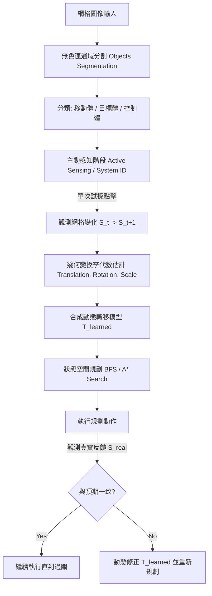

# ARC-AGI-3: 第一性原理之一般化互動控制與系統識別架構
# (First-Principles Generalized Control and System Identification Framework)

在 ARC-AGI-3 中，互動式拼圖（如帶有按鈕、滑軌、旋鈕的遊戲）本質上是一個**動態系統控制問題（Dynamic System Control Problem）**。
目前的啟發式規則（例如「假設滑軌每次點擊平移 3 格」）與大語言模型的直覺猜測，都違背了 AGI 的核心精神——**一般化泛化能力**。一旦滑軌步長改變、或是出現複合操作，硬編碼的模擬器與規則就會失效。

本文件從**第一性原理（First Principles）**出發，推導並設計一個不依賴具體遊戲規則、能夠自我學習與適應的一般化解決方案。

---

## 1. 系統的數學建模 (Mathematical Modeling)

任何互動式 ARC 遊戲都可以被抽象為一個**確定性有限狀態機（Deterministic Finite State Machine）**與**幾何變換李群（Lie Group of Geometric Transformations）**的結合：

1. **狀態空間 (State Space) $S$：** 
   網格中所有像素的二維排列，可以表示為一組幾何物件的集合：
   $$O = \{O_{\text{static}}, O_{\text{movable}}, O_{\text{actuator}}\}$$
   * $O_{\text{static}}$：靜態目標或障礙物（Target Markers）。
   * $O_{\text{movable}}$：受控制的移動形狀（Movable Shapes）。
   * $O_{\text{actuator}}$：互動介面（如按鈕、滑軌、旋鈕本體）。
   
2. **動作空間 (Action Space) $A$：**
   網格座標上的點擊：
   $$a_t = (x, y) \in \{0, \dots, H-1\} \times \{0, \dots, W-1\}$$

3. **系統轉移函數 (System Transition Function) $T$：**
   $$S_{t+1} = T(S_t, a_t)$$
   在遊戲開始時，$T$ 對於 Agent 是完全未知的（Black-box System）。

---

## 2. 解決方案的三大支柱 (The Three Pillars)

從第一性原理出發，一般化的解決方案必須包含以下三個步驟：**系統識別（System ID）**、**轉移函數合成（Transition Synthesis）**、與**閉環規劃（Closed-Loop Planning）**。



### 支柱一：主動系統識別 (Active System Identification)
AGI 不需要「猜測」按鈕功能，而是通過**主動探測（Active Sensing）**來發現因果關係：
* **步驟：** 在關卡初始階段（或 RESET 後），Agent 系統性地對所有被辨識為 $O_{\text{actuator}}$ 的座標進行一次「探針式點擊」（Probe Clicks）。
* **觀測：** 計算點擊前後的幾何特徵差：
  $$\Delta S = S_{t+1} - S_t$$
* **變換提取（Lie Algebra Estimation）：** 
  利用矩（Moments）或質心變化，提取移動體 $O_{\text{movable}}$ 的幾何變換參數：
  * **平移（Translation）：** $\vec{d} = \text{Centroid}(S_{t+1}) - \text{Centroid}(S_t)$
  * **旋轉（Rotation）：** $\Delta \theta = \text{Orientation}(S_{t+1}) - \text{Orientation}(S_t)$
  * **縮放（Scaling）：** $s = \frac{\text{Area}(S_{t+1})}{\text{Area}(S_t)}$

### 支柱二：動態轉移模型合成 (Dynamic Transition Model Synthesis)
在完成主動探測後，Agent 不需要依賴人類寫的 `simulate_click`，而是**動態合成**一個轉移算子矩陣 $M_a$：
* 對於每一個被激活的控制點 $a_i = (x, y)$，關聯一個幾何變換矩陣：
  $$T_{\text{learned}}(S, a_i) \Rightarrow \text{ApplyTransform}(S, \text{Type}(a_i), \text{Params}(a_i))$$
* 例如，學會了「點擊 $(10, 27)$ 會導致主要形狀旋轉 $+90^\circ$」；「點擊 $(34, 10)$ 會平移 $(+3, 0)$」。

### 支柱三：閉環狀態規劃 (Closed-Loop Planning & Execution)
一旦轉移函數 $T_{\text{learned}}$ 被建立，過關就變成了純粹的**狀態空間搜索（State-Space Search）**：
1. **設定起點與終點：** 起點為 $S_{\text{current}}$，終點為 $O_{\text{movable}}$ 的幾何特徵與 $O_{\text{static}}$ 完美重合（Overlap $\ge \text{Threshold}$）。
2. **搜索算法：** 使用 BFS、A* 或 Dijkstra 算法，在 $T_{\text{learned}}$ 的作用下，尋找最短的動作序列：
   $$\text{Path} = [a_1, a_2, \dots, a_k]$$
3. **閉環校正（Closed-Loop Control）：** 
   如果在執行 $a_i$ 時，真實反饋 $S_{\text{real}}$ 與模擬預期不符（例如撞牆、或是滑軌達到邊界極限），則：
   * 將該動作標記為失效或受限。
   * 動態修正 $T_{\text{learned}}$ 的邊界條件。
   * 立即重新規劃（Re-plan）剩餘步數。

---

## 3. 現有 Agent 的差距與改進路徑

| 維度 | 現有啟發式模擬器 (Current Implementation) | 第一性原理一般化解決方案 (First-Principles Solution) |
| :--- | :--- | :--- |
| **控制點識別** | 依賴規則分類（水平線/垂直線/方塊簇）來猜測是滑軌或旋鈕。 | 系統自動識別任何非背景、非目標、非移動體的獨立結構作為 Action Affordances。 |
| **變換機制** | 硬編碼移動步長（如 `shift_x = 3` 或旋轉 $90^\circ$）。 | 透過主動試探點擊，在運行時在線估計出確切的幾何變換參數（步長、旋轉方向）。 |
| **死鎖處理** | 攔截器阻截已失效點，但模擬器仍盲目推薦，導致陷入隨機探索的死循環。 | **動作感知規劃**：已失效的動作直接從動作轉移空間中剔除，強迫規算路徑避開死胡同。 |
| **對新遊戲適應** | 換一個新控制機制的遊戲（如拉伸、剪切變形）就會徹底失效。 | 無論何種變換，只要能被李群參數化表示，就能動態識別並求解。 |

---

## 4. 第一性原理架構的程式碼概念設計 (Conceptual Code Design)

```python
class FirstPrinciplesController:
    def __init__(self):
        self.transition_model = {} # key: action_id (or coordinate), value: GeometricTransform
        self.failed_actions = set()

    def identify_system(self, grid, actuators):
        """Active Sensing Phase: Probe each actuator to learn the system dynamics."""
        for act in actuators:
            # 1. Choose coordinate within actuator
            coord = act.get_probe_coordinate()
            # 2. Execute and observe S_t -> S_t+1
            grid_next = self.env.step(ACTION6(coord))
            # 3. Extract Lie Group Parameters
            transform = self.extract_geometric_transform(grid, grid_next)
            # 4. Save to Transition Model
            self.transition_model[coord] = transform

    def extract_geometric_transform(self, grid_a, grid_b):
        """Analyzes displacement of movable shapes between two states."""
        # Calculates translation vector, rotation delta, or scale delta
        ...
        return transform

    def plan_sequence(self, current_grid, target_grid):
        """Standard State-Space Search using the learned transition model."""
        queue = deque([(current_grid, [])])
        visited = {current_grid.tobytes()}
        
        while queue:
            state, path = queue.popleft()
            if self.is_aligned(state, target_grid):
                return path # Found optimal control sequence!
                
            for coord, transform in self.transition_model.items():
                if coord in self.failed_actions:
                    continue # Action-Aware Candidate Filtering
                
                next_state = transform.apply(state)
                if next_state.tobytes() not in visited:
                    visited.add(next_state.tobytes())
                    queue.append((next_state, path + [coord]))
        return []
```

---
*本框架將作為後續開發高度通用、自我進化型 ARC 求解器的理論指導基礎。*
